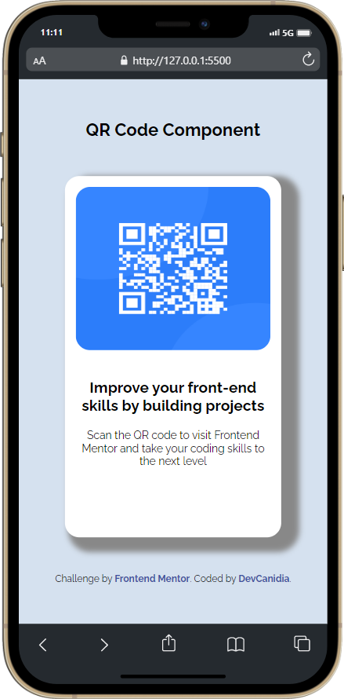
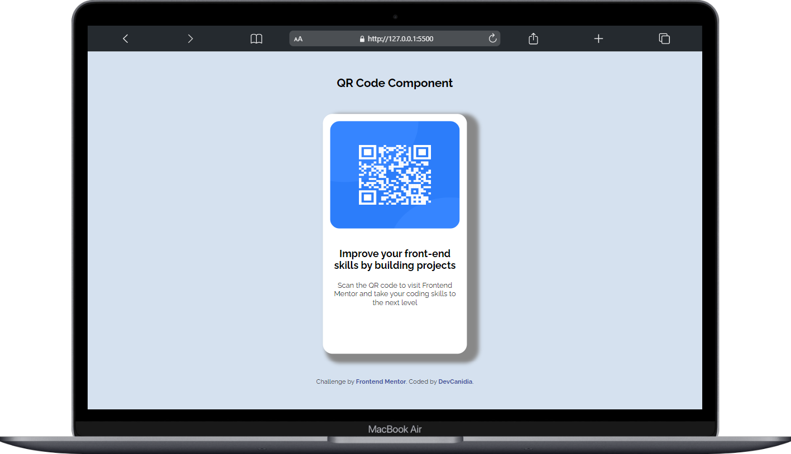

# Mentor de Frontend - solução de componente de código QR

Esta é uma solução para o [QR code component challenge on Frontend Mentor](https://www.frontendmentor.io/challenges/qr-code-component-iux_sIO_H). Os desafios do Frontend Mentor ajuda a melhorar as suas capacidades de codificação através da construção de projectos realistas. 

## Tabela de conteúdos

- [Visão Geral](#overview)
  - [Captura de ecrã](#screenshots)
  - [Links](#links)
- [O meu processo](#my-process)
  - [Construído com](#built-with)
  - [O que aprendi](#what-i-learned)
  - [desenvolvimento continuado](#continued-development)
  - [Recursos úteis](#useful-resources)
- [Autor](#author)
- [Agradecimentos](#acknowledgments)

**Note: Apague esta nota e actualize o índice com base nas secções que guarda.**

## Visão geral - Overview

### Captura de ecrã - Screenshots





### Ligações - Links

- URL da solução: [Adicione aqui o URL da solução](https://your-solution-url.com)


## O meu processo - my-process

#### Construído com - built-with

- Marcação HTML5 semântica
- Propriedades personalizadas do CSS
- Flexbox
- Box-Shadow


### O que aprendi - what-i-learned

Utilizei propriedades do css para posicionar, mudar cores e tamanho de fontes e acrescentei uma sombra que não tinha no projeto original para dar uma personalizada com o meu estilo.

Para ver como pode adicionar trechos de código, ver abaixo:

```html

    <div class="card">
        
        <h2>Improve your front-end skills by building projects</h2>
        <p>Scan the QR code to visit Frontend Mentor and take your coding skills to the next level</p>
    </div>
   
  
```
```css
.card {
    width: 300px;
    height: 500px;
    background: #fff;
    border-radius: 20px;
    box-shadow: 15px 10px 8px 10px #888888;
}
```


### Continuação do desenvolvimento - continued-development

Preciso revisar um pouco de posiciosamento e display para melhorar no aprendizado e rapidez dos projetos com css.


### Recursos úteis - useful-resources

- [Dev Media](https://www.devmedia.com.br/como-centralizar-divs-em-html-e-css/37568) - Isto ajudou-me na parte de centralizar os elementos.


## Autor - author

- Website - [Dev Canidia](https://devcanidia.netlify.app/)
- Frontend Mentor - [@DevProCanidia](https://www.frontendmentor.io/profile/DevProCanidia)


## Agradecimentos - acknowledgments

Agradeço as comunidades que me ajudarão nesse projeto:
@dankicode @devmedia @cursoemvideo @jornadadev


